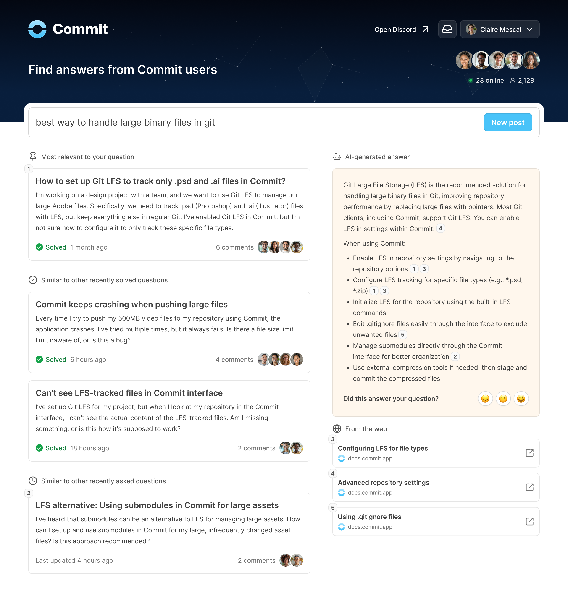

Search is how people ask questions and find answers on your [community site](/community-site).

Search leverages our powerful [answer engine](/answer-engine) to surface relevant posts from all your [channels](/channels).

<Frame>

</Frame>

Using our [answer engine](/answer-engine), relevant posts are displayed to people and are ranked by how useful and related the information is to their search query or question.

Search results also display an AI-generated answer that is powered by our [answer engine](/answer-engine) and any [sources](/sources) you have added.

From the search results, a person can click to open any post in a modal to read and learn more about discussions related to their question.